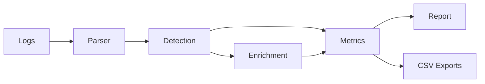

# Cybersecurity Log Analyzer

## Project Overview
Cybersecurity Log Analyzer is a Python project that parses SSH authentication logs, detects suspicious activity, and generates an HTML security report with interactive charts. The project is structured for a professional GitHub portfolio and simulates a SOC-style workflow.

## Security Features
- Log parsing for SSH authentication events
- Brute force detection (failed attempts in short time windows)
- Suspicious IP detection based on failed attempts
- Risk scoring per IP (LOW / MEDIUM / HIGH)
- Top attacking IPs and most targeted users
- Security metrics and frequency analysis
- Optional IP geolocation enrichment (country/city)
- Interactive Plotly visualizations
- HTML report generation
- CSV exports for further analysis

## Architecture
Mermaid diagram:



Text flow: Logs -> Parser -> Detection -> Metrics -> Report

## How It Works
1. Parse raw SSH log lines into a pandas DataFrame.
2. Detect brute force patterns and suspicious IPs.
3. Optionally enrich IPs with geolocation.
4. Compute security metrics and aggregate time-based statistics.
5. Build Plotly charts and generate an HTML report.
6. Export CSV summaries for further analysis.

## Example Logs
```
Jan 10 10:15:32 server sshd[12345]: Failed password for root from 192.168.1.25 port 22 ssh2
Jan 10 10:16:22 server sshd[12348]: Accepted password for ubuntu from 10.0.0.5 port 22 ssh2
```

## Generated Reports
- Output file: `outputs/security_report.html`
- Contains summary metrics, risk scores by IP, interactive charts, suspicious IPs, and targeted users.

## CSV Exports
The analyzer exports CSV files to `outputs/`:
- `attack_summary.csv`
- `top_attacking_ips.csv`
- `targeted_users.csv`

## Installation
```
python -m venv .venv
.venv\Scripts\activate
pip install -r requirements.txt
```

## Usage
Generate fake logs:
```
python scripts\generate_fake_logs.py --count 2000 --output data\auth.log
```

Run the analyzer:
```
python main.py --log data\auth.log --report outputs\security_report.html
```

Optional geolocation:
```
setx GEOLOCATION_ENABLED true
setx GEOLOCATION_PROVIDER ipinfo
setx GEOLOCATION_API_KEY your_token_here
```

Run tests:
```
pytest
```
